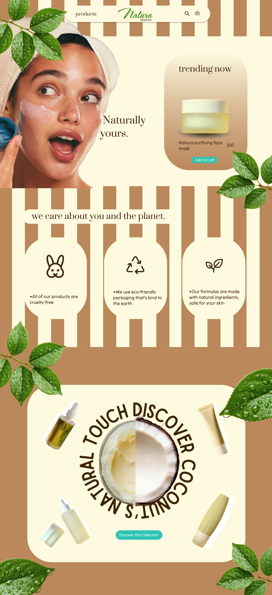
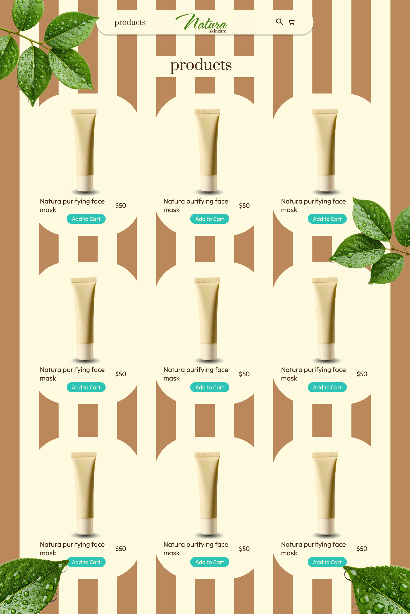
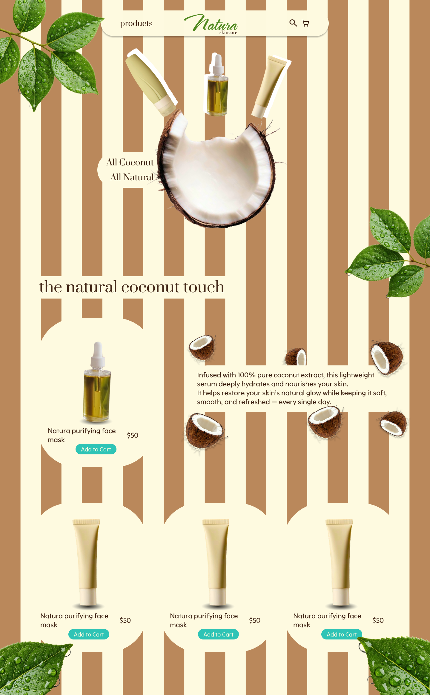

# Natura Skincare Web App 🌿  
A modern, minimal, and user-friendly skincare website. This project is built to practice frontend development while also showcasing a custom UI/UX design that I created entirely in Figma.

## Status
**The project is currently under active development.**  
New components, pages, and responsive improvements are being added continuously.

## Design  
All UI/UX design work for this project was created by me using Figma.  
Design goals included:  
- Clean and natural aesthetics  
- Soft and calming color palette  
- Readable and balanced typography  
- Minimal, distraction-free user experience  

## Technologies  
This project is being developed with:

- **HTML5**  
- **CSS3 / SCSS** 
- **JavaScript (ES6+)**  
- **Figma** — UI/UX Design  

## Design Overview (Figma)

Here are the main screens of the design:

| Home | Product Listing | Product Detail |
|------|------------------|----------------|
|  |  |  |

